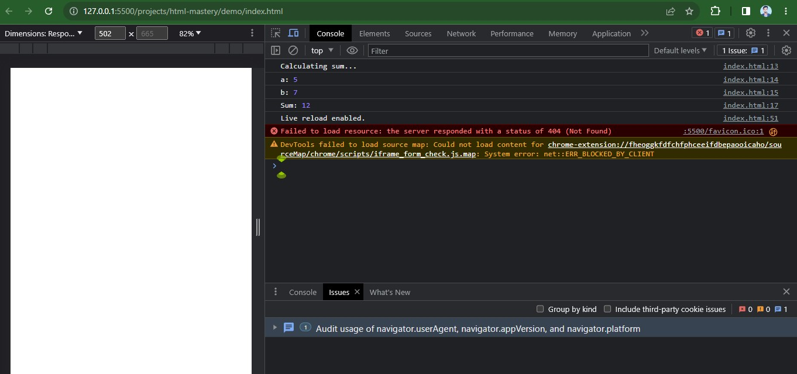

## Introduction:
Debugging is an essential skill for JavaScript developers. 
Being able to identify and fix bugs in your code is crucial for building reliable and functional applications. 
In this step-by-step guide, we will explore the 
fundamentals of debugging in JavaScript and introduce you to effective techniques and tools to help you master the art of debugging.


## Table of Contents:
1. **What is Debugging?**
2. **Types of Debugging in JavaScript**
   - Console.log
   - Debugger Statement
   - Browser DevTools
   - Logging Frameworks
   - Stack Trace
3. **Tips for Effective Debugging**
4. **Conclusion**

### 1. What is Debugging?
At its core, debugging involves the process of identifying and resolving errors or issues in code. By debugging your JavaScript applications, you gain insights into how your code behaves and can fix any unexpected behaviors or errors that may arise.

### 2. Types of Debugging in JavaScript
Let's explore different debugging techniques and tools available in JavaScript:

- **Console.log**: One of the simplest and most commonly used debugging techniques is inserting console.log statements in your code. This allows you to print values and messages to the browser console for debugging purposes. Consider the following example:

  ```javascript
  function calculateSum(a, b) {
    console.log('Calculating sum...');
    console.log('a:', a);
    console.log('b:', b);
    let sum = a + b;
    console.log('Sum:', sum);
    return sum;
  }
  
  calculateSum(5, 7);
  ```

  

- **Debugger Statement**: The debugger statement is another powerful debugging tool. When encountered, it pauses the code execution and allows you to inspect variables and step through the code in the browser's debugging tools. Consider the following example:

  ```javascript
  function calculateSum(a, b) {
    debugger;
    let sum = a + b;
    return sum;
  }
  
  calculateSum(5, 7);
  ```

  

- **Browser DevTools**: Modern web browsers provide comprehensive developer tools, commonly known as DevTools, which offer a range of debugging features. Access DevTools by right-clicking on a web page and selecting "Inspect" or by using keyboard shortcuts. DevTools provide features like breakpoints, step-by-step execution, variable inspection, call stack tracking, and network monitoring. Here's an example of setting a breakpoint in the Chrome DevTools:

  

- **Logging Frameworks**: Logging frameworks, such as console.log, console.debug, console.error, and console.warn, allow for more controlled logging. You can use different logging levels to display relevant information during code execution. Here's an example:

  ```javascript
  console.log('This is a log message');
  console.debug('This is a debug message');
  console.error('This is an error message');
  console.warn('This is a warning message');
  ```

- **Stack Trace**: When an error occurs in your JavaScript code, the browser console displays an error message along with a stack trace. The stack trace shows the sequence of function calls leading to the error, helping you trace back to the source of the problem. Here's an example:

  

  <h3 align="center"> OR </h3>

  

### 3. Tips for Effective Debugging
To become a proficient debugger, consider the following tips:

1. **Understand the Problem**: Clearly define the problem and identify the expected behavior versus the actual behavior of your code.

2. **Isolate the Problem**: Comment out or temporarily remove unrelated code to focus on the specific part of the code that exhibits the issue.

3. **Use Breakpoints**: Set breakpoints at strategic locations to pause the execution and inspect variables and values.

4. **Inspect Variables**: Utilize the browser's debugging tools to inspect the values of variables and objects during execution.

5. **Check Error Messages**: Pay attention to error messages displayed in the console. They often provide valuable information about the nature and location of the error.

6. **Step Through the Code**: Use the step-by-step execution feature in the browser's debugging tools to analyze the flow of execution and pinpoint the cause of the issue.

7. **Reproduce the Issue**: Create a minimal, reproducible example that demonstrates the problem. This will help you and others in understanding and resolving the issue.

8. **Seek Community Support**: Don't hesitate to seek help from online communities and forums when you're stuck. Share the relevant code and error messages for better assistance.

### 4. Conclusion:
By mastering the art of debugging, you gain the ability to identify and fix errors in your JavaScript code effectively. The debugging techniques and tools covered in this guide, including console.log, debugger statements, browser DevTools, logging frameworks, and stack traces, will empower you to tackle bugs with confidence. Remember to practice these techniques regularly, and don't hesitate to seek help from the community when needed.

***Happy debugging!***
