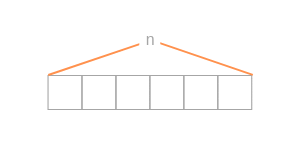

# Array-based Problems

***Let's start by defining what arrays are and then dive into the content you requested.***

## Arrays:



An array is a data structure that stores a fixed-size sequential collection of elements of the same type. It allows you to store multiple values of the same data type under a single variable name. Each value in the array is called an element, and it is identified by its index, which represents its position in the array. Arrays are widely used in programming as they provide efficient ways to store and access elements.

***Now, let's proceed to the content you requested with code examples in Java.***

### 1. Array Manipulation and Traversal:

Array manipulation involves performing operations on array elements, such as modifying their values or rearranging them. Array traversal refers to accessing each element of the array to perform some action on it.

**Array Creation and Initialization:**

```java title="Main.java"
// Declaration and initialization of an array
int[] numbers = new int[5]; // Creates an integer array of size 5

// Initialization with values
int[] numbers = {1, 2, 3, 4, 5}; // Creates an integer array with values
```

**Array Traversal:**

```java title="Main.java"
for (int i = 0; i < numbers.length; i++) {
    System.out.println(numbers[i]);
}
```

### 2. Searching and Sorting Algorithms:

**Linear Search:** In linear search, we iterate through the array and compare each element with the target value until a match is found or the end of the array is reached.

```java title="Main.java"
public static int linearSearch(int[] arr, int target) {
    for (int i = 0; i < arr.length; i++) {
        if (arr[i] == target) {
            return i; // Return the index if the element is found
        }
    }
    return -1; // Return -1 if the element is not found
}
```

**Binary Search:** Binary search is an efficient search algorithm for sorted arrays. It repeatedly divides the search space in half by comparing the target value with the middle element.

```java title="Main.java"
public static int binarySearch(int[] arr, int target) {
    int low = 0;
    int high = arr.length - 1;

    while (low <= high) {
        int mid = low + (high - low) / 2;

        if (arr[mid] == target) {
            return mid; // Return the index if the element is found
        } else if (arr[mid] < target) {
            low = mid + 1;
        } else {
            high = mid - 1;
        }
    }

    return -1; // Return -1 if the element is not found
}
```

**Bubble Sort:**  Bubble sort repeatedly swaps adjacent elements if they are in the wrong order until the entire array is sorted.

```java title="Main.java"
public static void bubbleSort(int[] arr) {
    int n = arr.length;

    for (int i = 0; i < n - 1; i++) {
        for (int j = 0; j < n - i - 1; j++) {
            if (arr[j] > arr[j + 1]) {
                // Swap arr[j] and arr[j + 1]
                int temp = arr[j];
                arr[j] = arr[j + 1];
                arr[j + 1] = temp;
            }
        }
    }
}
```

**Insertion Sort:** Insertion sort builds the final sorted array one element at a time, by inserting each element into its correct position within the already sorted portion of the array.

```java title="Main.java"
public static void insertionSort(int[] arr) {
    int n = arr.length;

    for (int i = 1; i < n; i++) {
        int key = arr[i];
        int j = i - 1;

        while (j >= 0 && arr[j] > key) {
            arr[j + 1] = arr[j];
            j--;
        }

        arr[j + 1] = key;
    }
}
```

**Quicksort:**
- Quicksort is an efficient sorting algorithm that follows the divide-and-conquer paradigm.
- It works by selecting a pivot element from the array and partitioning the other elements into two subarrays, according to whether they are less than or greater than the pivot.
- The subarrays are then recursively sorted, and the sorted subarrays are combined to obtain the final sorted array.

```java title="Main.java"
public static void quickSort(int[] arr, int low, int high) {
    if (low < high) {
        int pivotIndex = partition(arr, low, high);

        quickSort(arr, low, pivotIndex - 1);
        quickSort(arr, pivotIndex + 1, high);
    }
}

private static int partition(int[] arr, int

 low, int high) {
    int pivot = arr[high];
    int i = low - 1;

    for (int j = low; j < high; j++) {
        if (arr[j] < pivot) {
            i++;

            // Swap arr[i] and arr[j]
            int temp = arr[i];
            arr[i] = arr[j];
            arr[j] = temp;
        }
    }

    // Swap arr[i+1] and arr[high] (put the pivot in its correct position)
    int temp = arr[i + 1];
    arr[i + 1] = arr[high];
    arr[high] = temp;

    return i + 1;
}
```

**Mergesort:**
- Mergesort is a divide-and-conquer sorting algorithm that divides the array into smaller subarrays, sorts them, and then merges them to obtain the final sorted array.
- It works by recursively dividing the array in half until each subarray has only one element. Then, it merges the subarrays in a sorted manner to produce the final sorted array.

```java title="Main.java"
public static void mergeSort(int[] arr, int low, int high) {
    if (low < high) {
        int mid = low + (high - low) / 2;

        mergeSort(arr, low, mid);
        mergeSort(arr, mid + 1, high);

        merge(arr, low, mid, high);
    }
}

private static void merge(int[] arr, int low, int mid, int high) {
    int leftSize = mid - low + 1;
    int rightSize = high - mid;

    int[] leftArray = new int[leftSize];
    int[] rightArray = new int[rightSize];

    for (int i = 0; i < leftSize; ++i) {
        leftArray[i] = arr[low + i];
    }

    for (int j = 0; j < rightSize; ++j) {
        rightArray[j] = arr[mid + 1 + j];
    }

    int i = 0, j = 0, k = low;

    while (i < leftSize && j < rightSize) {
        if (leftArray[i] <= rightArray[j]) {
            arr[k] = leftArray[i];
            i++;
        } else {
            arr[k] = rightArray[j];
            j++;
        }
        k++;
    }

    while (i < leftSize) {
        arr[k] = leftArray[i];
        i++;
        k++;
    }

    while (j < rightSize) {
        arr[k] = rightArray[j];
        j++;
        k++;
    }
}
```

### 3. Subarray Problems:
Subarray problems involve finding a contiguous subarray within the given array that satisfies certain conditions. Two common subarray problems are:

**Maximum Subarray Sum:** Given an array of integers, find the subarray with the maximum sum.

```java title="Main.java"
public static int maxSubarraySum(int[] arr) {
    int currentSum = arr[0];
    int maxSum = arr[0];

    for (int i = 1; i < arr.length; i++) {
        currentSum = Math.max(arr[i], currentSum + arr[i]);
        maxSum = Math.max(maxSum, currentSum);
    }

    return maxSum;
}
```

**Subarray with Given Sum:** Given an array of integers and a target sum, find a subarray that adds up to the target sum.

```java title="Main.java"
public static int[] subarrayWithGivenSum(int[] arr, int target) {
    int currentSum = arr[0];
    int start = 0;

    for (int i = 1; i <= arr.length; i++) {
        while (currentSum > target && start < i - 1) {
            currentSum -= arr[start];
            start++;
        }

        if (currentSum == target) {
            int[] subarray = new int[i - start];
            System.arraycopy(arr, start, subarray, 0, i - start);
            return subarray;
        }

        if (i < arr.length) {
            currentSum += arr[i];
        }
    }

    return new int[0];
}
```

### 4. Two-Pointer Technique:
The two-pointer technique is a popular approach for solving array problems that involve searching, finding pairs, or checking conditions using two pointers moving through the array.

```java title="Main.java"
public static boolean twoPointerTechnique(int

[] arr, int target) {
    int left = 0;
    int right = arr.length - 1;

    while (left < right) {
        int sum = arr[left] + arr[right];

        if (sum == target) {
            return true;
        } else if (sum < target) {
            left++;
        } else {
            right--;
        }
    }

    return false;
}
```

### 5. Prefix Sum Technique:
   - Prefix sum is a technique used to efficiently calculate the sum of elements within a range of an array.
   - It involves precomputing the cumulative sum of elements and then using it to quickly calculate the sum within a given range.
   - This technique is useful in various problems involving subarray sums, range queries, and finding intervals with a specific property.

```java title="Main.java"
public static int[] calculatePrefixSum(int[] arr) {
    int n = arr.length;
    int[] prefixSum = new int[n];
    prefixSum[0] = arr[0];

    for (int i = 1; i < n; i++) {
        prefixSum[i] = prefixSum[i - 1] + arr[i];
    }

    return prefixSum;
}
```

### 6. Sliding Window Technique:
   - The sliding window technique is commonly used for efficiently solving problems that involve subarrays or subarrays of a fixed length.
   - It uses a window that slides through the array to track the elements within the current window, updating the window as it moves.
   - This technique is useful for solving problems related to subarray sums, averages, and finding maximum or minimum values within a window.

```java title="Main.java"
public static int maxSubarraySumOfSizeK(int[] arr, int k) {
    int maxSum = 0;

    // Compute the sum of the first window
    for (int i = 0; i < k; i++) {
        maxSum += arr[i];
    }

    int currentSum = maxSum;

    // Slide the window and update the maximum sum
    for (int i = k; i < arr.length; i++) {
        currentSum += arr[i] - arr[i - k];
        maxSum = Math.max(maxSum, currentSum);
    }

    return maxSum;
}
```

### 7. Array Rotation:
   - Array rotation refers to the operation of shifting the elements of an array in a circular fashion.
   - Rotating an array can be done left or right and by a certain number of positions.
   - This operation is useful in solving problems that involve circular lists, circular queues, or reordering array elements.

```java title="Main.java"
public static void rotateArray(int[] arr, int k) {
    int n = arr.length;
    k = k % n;  // Adjust k if it exceeds the array length

    reverseArray(arr, 0, n - 1);        // Reverse the whole array
    reverseArray(arr, 0, k - 1);        // Reverse the first k elements
    reverseArray(arr, k, n - 1);        // Reverse the remaining elements
}

private static void reverseArray(int[] arr, int start, int end) {
    while (start < end) {
        int temp = arr[start];
        arr[start] = arr[end];
        arr[end] = temp;
        start++;
        end--;
    }
}
```

These examples provide a solid foundation for understanding arrays and solving array-based problems in Java. Remember to practice and explore more problem-solving scenarios to enhance your skills in DSA.