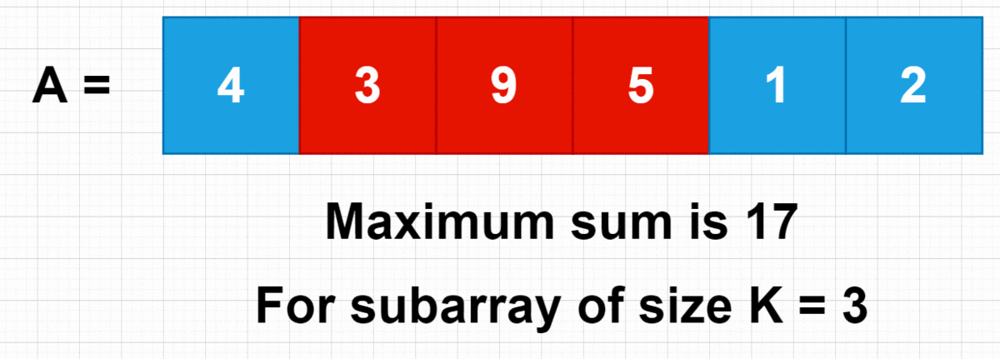

# 3. Maximum Subarray

## Problem: 
Maximum Subarray Problem - Finding the Subarray with the Largest Sum



## Description:
The Maximum Subarray problem involves finding the contiguous subarray within an array of integers that has the largest sum. It is a common problem in algorithmic interviews and has various efficient solutions.

## Algorithms:
### 1. Brute Force: 
This approach involves checking all possible subarrays and calculating their sums to find the maximum sum. However, it is not an efficient solution and has a time complexity of O(n^2).

### 2. Kadane's Algorithm: 
This algorithm provides an efficient solution to the Maximum Subarray problem. It uses dynamic programming to keep track of the maximum sum of subarrays encountered so far. The algorithm has a time complexity of O(n) and a space complexity of O(1).

## Approach:
### 1. Brute Force Approach:
- Iterate over all possible subarrays.
- Calculate the sum of each subarray.
- Keep track of the maximum sum encountered.
- Return the maximum sum.

### 2. Kadane's Algorithm:
- Initialize two variables, maxSum and currentSum, to store the maximum sum and the sum of the current subarray, respectively.
- Iterate over the array:
  - Update currentSum by adding the current element or starting a new subarray from the current element, whichever is larger.
  - Update maxSum if currentSum is greater.
- Return maxSum.

**Time Complexity (TC):**
- Brute Force: O(n^2) - due to nested loops iterating over all possible subarrays.
- Kadane's Algorithm: O(n) - as it requires a single pass over the array.

**Space Complexity (SC):**
- Brute Force: O(1) - no additional space is required.
- Kadane's Algorithm: O(1) - as it uses only a constant amount of space.

## Flowchart:
```
start
|
|-- Iterate over the array
|   |
|   |-- Calculate currentSum
|   |-- Update maxSum if necessary
|
|-- Return maxSum
end
```

## Solution in Java:

```java
public static int maxSubarraySum(int[] arr) {
    int maxSum = arr[0];
    int currentSum = arr[0];

    for (int i = 1; i < arr.length; i++) {
        currentSum = Math.max(arr[i], currentSum + arr[i]);
        maxSum = Math.max(maxSum, currentSum);
    }

    return maxSum;
}
```

## Explanation:
The solution uses Kadane's Algorithm to find the maximum subarray sum. It initializes the variables `maxSum` and `currentSum` with the first element of the array. Then, it iterates over the remaining elements of the array. For each element, it calculates `currentSum` by taking the maximum of the current element or adding it to the previous `currentSum`. It updates `maxSum` if `currentSum` becomes greater. Finally, it returns `maxSum`, which represents the maximum sum of any subarray within the given array.

The solution has a time complexity of O(n) as it performs a single pass over the array. It uses only a constant amount of extra space, resulting in a space complexity of O(1).

This solution efficiently solves the Maximum Subarray problem by finding the subarray with the largest sum. By understanding the Kadane's Algorithm and its implementation, you can tackle similar problems and improve your understanding of dynamic programming and efficient subarray algorithms.

I hope this tutorial helps you understand and solve the Maximum Subarray problem effectively!