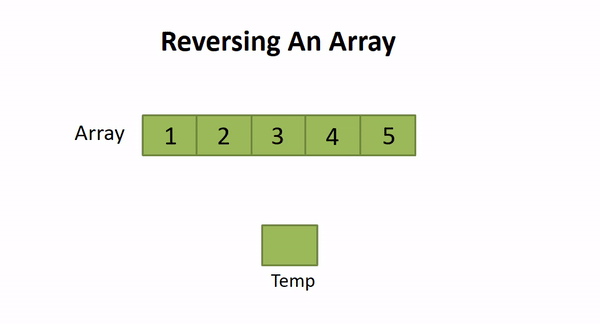

# 2. Reverse the Array

## Problem: Reversing an Array:



## Description: 
This tutorial will guide you through the process of reversing an array in Java. Reversing an array involves changing the order of its elements so that the first element becomes the last, the second element becomes the second-to-last, and so on. Understanding how to reverse an array is a fundamental skill in programming and can be useful in various scenarios.

## Algorithm:
To reverse an array, we can use the following algorithm:
1. Initialize two pointers, `start` and `end`, pointing to the first and last elements of the array, respectively.
2. Swap the elements at the `start` and `end` positions.
3. Increment the `start` pointer and decrement the `end` pointer.
4. Repeat steps 2 and 3 until the `start` pointer surpasses the `end` pointer.
5. The array is now reversed.

## Approach:
1. Initialize the `start` pointer to the first index (0) and the `end` pointer to the last index (array length - 1).
2. Iterate until the `start` pointer is less than the `end` pointer:
   a. Swap the elements at positions `start` and `end`.
   b. Increment the `start` pointer by 1 and decrement the `end` pointer by 1.
3. The array is now reversed.

**Time Complexity (TC):** O(N), where N is the number of elements in the array. We iterate through half of the array to perform the swapping.

**Space Complexity (SC):** O(1). We perform the reversal in-place without using any additional data structures.

## Flowchart:
```
start
│
├─┬─┬─┬─┬─┬─┬─┬─┬─┬─┬─┬─┬─┬─┬─┬─┬─┬─┬─┬─┬─┬─┬─┬─┬─┬─┤
│ │ │ │ │ │ │ │ │ │ │ │ │ │ │ │ │ │ │ │ │ │ │ │ │ │ │
│ ▼ ▼ ▼ ▼ ▼ ▼ ▼ ▼ ▼ ▼ ▼ ▼ ▼ ▼ ▼ ▼ ▼ ▼ ▼ ▼ ▼ ▼ ▼ ▼ ▼ ▼ 
| Initialize start = 0
| Initialize end = array.length - 1
│ Swap elements at positions start and end
│ Increment start by 1
│ Decrement end by 1
│ Check if start < end
│ ──┬─────────────────────────────────────────────────┬─
│   │                                                 │
│   │                                                 ▼
│   │                                             ┌──────┐
│   │                                             │ END  │
│   │                                             └──────┘
│   │
│   ▼
│ Array is now reversed
└─────────────────────────────────────────────────────────┐
                                                          │
                                                          ▼
                                                      ┌──────┐
                                                      │ STOP │
                                                      └──────┘

```

## Solution in Java:
```java
public class ArrayReversal {
    public static void reverseArray(int[] arr) {
        int start = 0;
        int end = arr.length - 1;

        while (start < end) {
            // Swap elements at start and end positions
            int temp = arr[start];
            arr[start] = arr[end];
            arr[end] = temp;

            // Increment start and decrement end
            start++;
            end--;
        }
    }

    public static void main(String[] args) {
        int[] array = {1, 2, 3, 4, 5};
        System.out.println("Original array: " + Arrays.toString(array));

        reverseArray(array);
        System.out.println("Reversed array: " + Arrays.toString(array));
    }
}
```

## Explanation:
1. We define a `reverseArray` method that takes an array as input and reverses its elements using the two-pointer technique.
2. In the `main` method, we create an array and print its original state.
3. We then call the `reverseArray` method to reverse the array.
4. Finally, we print the reversed array.

This tutorial provides a comprehensive explanation of reversing an array in Java, including the algorithm, approach, time and space complexity, a flowchart visualizing the steps, and a complete solution with an explanation.