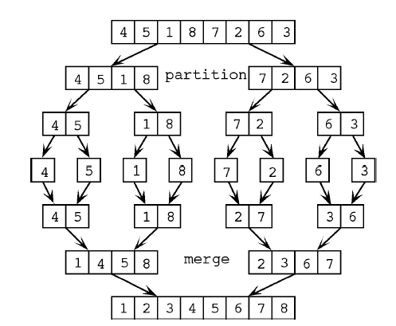

# Introduction To Algorithms

### 1. Complexity Analysis (Big O Notation, Time and Space Complexity):


   - **Explanation:**
     - Complexity analysis helps measure the efficiency of an algorithm in terms of time and space.
     - Big O notation provides an upper bound on the growth rate of an algorithm, indicating how the algorithm's performance scales with the input size.

   - **Example code:**     
     ```java title="Main.java"
     // Example: Calculating the sum of an array
     public int calculateSum(int[] arr) {
         int sum = 0;
         for (int num : arr) {
             sum += num;
         }
         return sum;
     }
     ```   

   - **Explanation:**
     - In the code above, we calculate the sum of an array by iterating through each element and accumulating the sum.
     - The time complexity of this code is O(n), where n is the size of the input array, as we perform a constant-time operation (addition) for each element.
     - The space complexity is O(1) because we only use a single variable (sum) to store the result.

### 2. Divide and Conquer Paradigm:


   - **Explanation:**
     - The divide and conquer paradigm involves breaking down a problem into smaller subproblems, solving them recursively, and combining the solutions to solve the original problem.
     - It often involves three steps: divide, conquer, and combine.

   - **Example code (Java):**
     ```java title="Main.java"
     // Example: Finding the maximum element in an array using divide and conquer
     public int findMax(int[] arr, int start, int end) {
         if (start == end) {
             return arr[start];
         } else {
             int mid = (start + end) / 2;
             int leftMax = findMax(arr, start, mid);
             int rightMax = findMax(arr, mid + 1, end);
             return Math.max(leftMax, rightMax);
         }
     }
     ```

   - **Explanation:**
     - The code above demonstrates a recursive approach to finding the maximum element in an array.
     - We divide the array into two halves until we reach individual elements.
     - Then, we compare and combine the maximum elements from the left and right halves using the `Math.max()` function.
     - The time complexity of this algorithm is O(n log n) since we divide the array in half at each recursive step, resulting in a balanced binary tree of recursive calls.
     - The space complexity is O(log n) due to the recursive calls on the stack.

### 3. Greedy Algorithms:

 

   - **Explanation:**
     - Greedy algorithms make locally optimal choices at each step with the hope of finding a global optimum.
     - They usually involve a greedy choice property and optimal substructure.

   - **Example code (Java):**
     
     ```java 
     // Example: Fractional Knapsack problem using a greedy approach
     class Item {
         int weight;
         int value;

         public Item(int weight, int value) {
             this.weight = weight;
             this.value = value;
         }
     }

     public double fractionalKnapsack(Item[] items, int capacity) {
         Arrays.sort(items, (a, b) -> Double.compare((double) b.value / b.weight, (double) a.value / a.weight));
         double totalValue = 0.0;
         int currentCapacity = capacity;

         for (Item item : items) {
             if (currentCapacity >= item.weight) {
                 totalValue += item.value;
                 currentCapacity -= item.weight;
             } else {
                 double fraction = (double) currentCapacity / item.weight;
                 totalValue += fraction * item.value;
                 break;
             }
         }

         return totalValue;
     }
     ```     

   - **Explanation:**
     - The code above demonstrates a greedy approach to solve the Fractional Knapsack problem, where items have weights and values, and we aim to maximize the total value while fitting within a given capacity.
     - The items are sorted in descending order based on the value-to-weight ratio.
     - We iterate through the sorted items and add them to the knapsack as long as there is enough capacity.
     - If the current item cannot fit entirely, we take a fraction of it to maximize the value.
     - The time complexity of this algorithm is O(n log n) due to the sorting operation.
     - The space complexity is O(1) as we only use a constant amount of additional memory.

### 4. Dynamic Programming:


   - **Explanation:**
     - Dynamic programming is a technique to solve complex problems by breaking them down into overlapping subproblems and storing the results of subproblems to avoid redundant computation.
     - It is applicable when a problem exhibits optimal substructure and overlapping subproblems.

   - **Example code (Java):**
     ```java title="Main.java"
     // Example: Fibonacci sequence using dynamic programming (bottom-up approach)
     public int fibonacci(int n) {
         if (n <= 1) {
             return n;
         }
         int[] dp = new int[n + 1];
         dp[0] = 0;
         dp[1] = 1;

         for (int i = 2; i <= n; i++) {
             dp[i] = dp[i - 1] + dp[i - 2];
         }

         return dp[n];
     }
     ```

   - **Explanation:**
     - The code above demonstrates calculating the nth Fibonacci number using dynamic programming.
     - We use an array (`dp`) to store the results of previously computed Fibonacci numbers.
     - We start with the base cases (F(0) = 0, F(1) = 1) and iteratively compute the Fibonacci numbers up to the desired value.
     - By storing the results in the array, we avoid redundant computations and improve efficiency.
     - The time complexity of this algorithm is O(n) since we compute each Fibonacci number once.
     - The space complexity is O(n) since we use an additional array of size n+1.

I hope these code examples and explanations help you understand the mentioned topics better! Remember to practice implementing and solving problems using these concepts to reinforce your understanding.